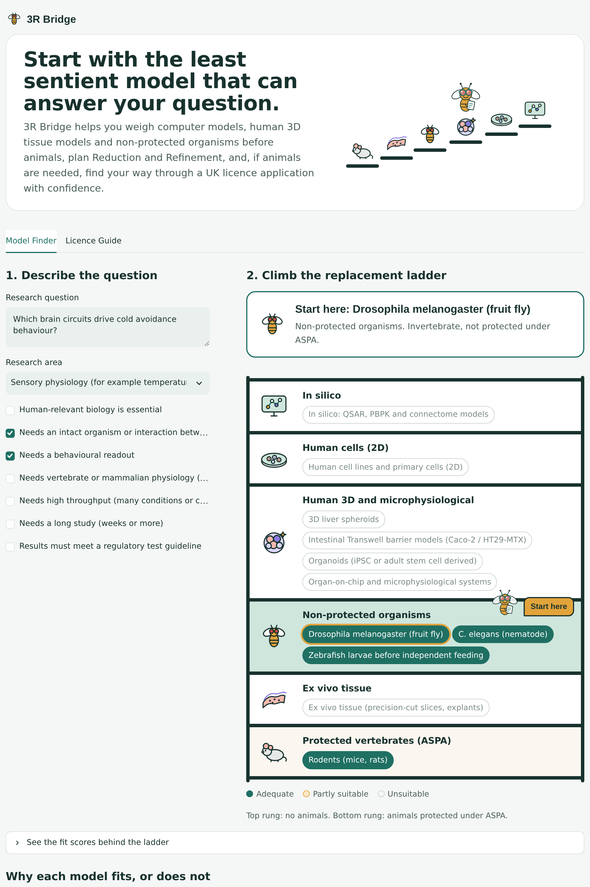
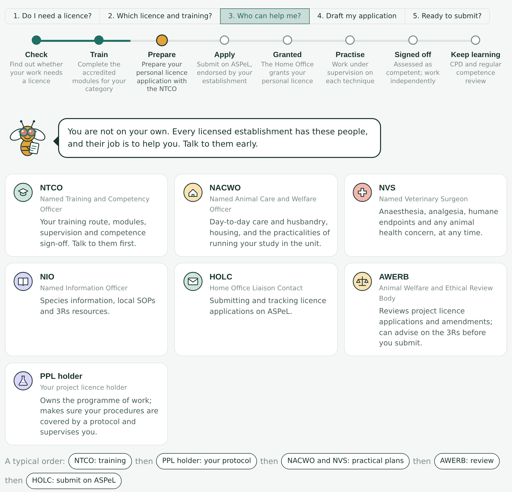
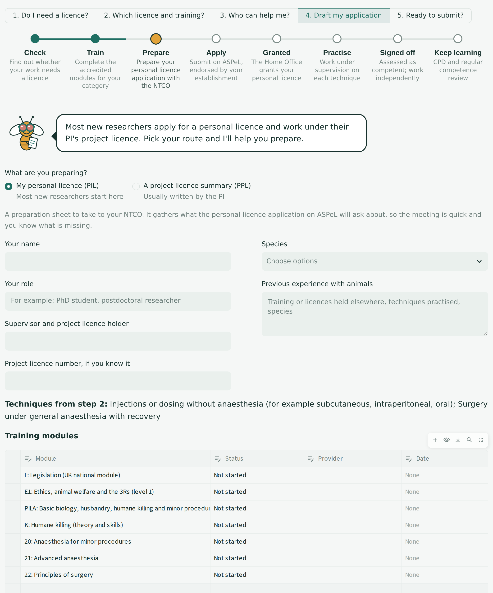
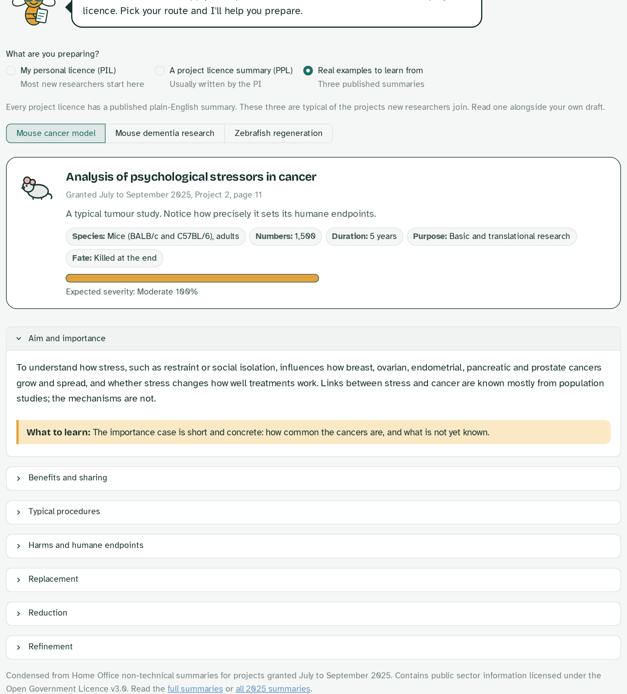
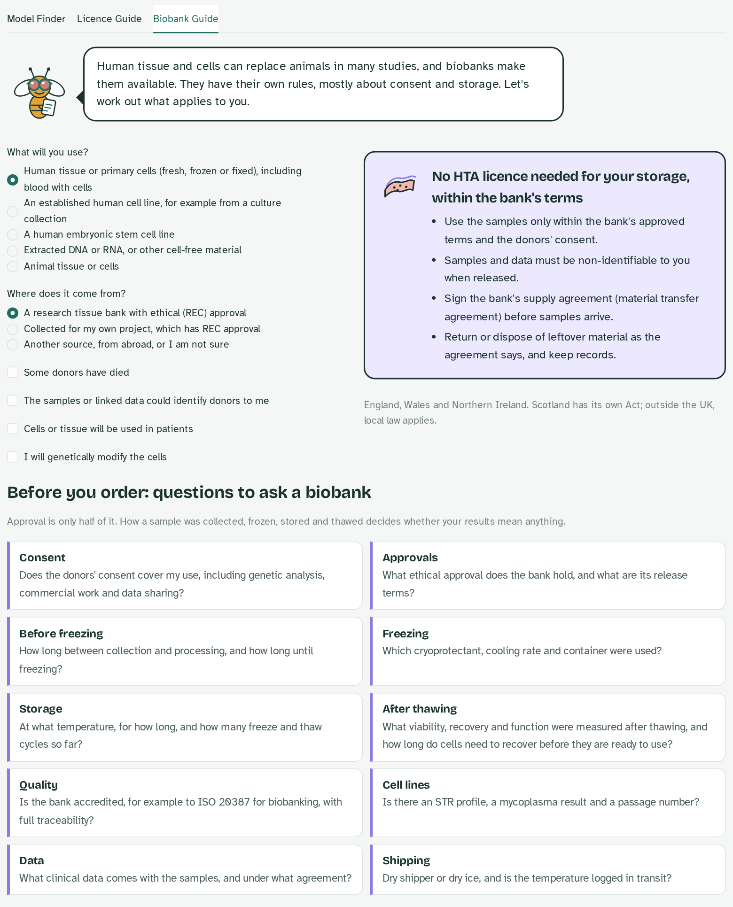

# 3R Bridge

**Choose, preserve and justify the least sentient model that can answer a research question.**

3R Bridge is a small interactive tool for researchers, Named Persons and ethical review bodies. It has three parts:

- **Model Finder.** Describe a research question and climb a *replacement ladder*, from computer models and human 3D tissue models, through non-protected organisms such as the fruit fly, to protected vertebrates. Then size the study (Reduction), plan welfare measures (Refinement) and export a short 3Rs justification.
- **Licence Guide.** A plain-English, step-by-step guide for researchers new to in vivo work in the UK, who may feel daunted by the regulations: do I need a licence, which personal licence category and training, who to talk to, and help preparing either a personal licence application or a project licence non-technical summary. A journey map shows where you are, a jargon buster explains every acronym, and Dot, a fruit fly in lab goggles, keeps you company.
- **Biobank Guide.** Human tissue and cells are often the best replacement for animals, but they bring their own rules. Pick the material (tissue, cell line, embryonic stem cell line, extracted DNA or RNA, animal tissue) and its source, and see which approvals apply under the Human Tissue Act, plus the questions to ask a biobank before you order.



## Why I built it

My work sits on the bridge between in vivo and in vitro research. I have carried out rodent studies, and I now develop ways to cryopreserve human 3D models (liver spheroids, intestinal barrier models, assay-ready cell monolayers) and Drosophila embryos, so that validated non-animal models can be banked and shared instead of rebuilt for every study. The question I keep coming back to is simple: *what is the least sentient model that can genuinely answer this question?* 3R Bridge is my attempt to make that question quick and transparent to ask.

The Biobank Guide came out of the SLTB 2026 pre-conference mini-symposium at BIOCEV, *Cryopreservation, Biobanking and Functional Readiness of Cell-based and Bioengineered Systems*, where I spoke on controlling ice formation in 3D cell models. Talks from biobanks in the Czech Republic and Germany, and the debate on whether cryopreserved products should be ready to use straight after thawing, made a point that is easy to miss: a sample is only useful if it is ethically sourced, properly approved, and stored and thawed in a way that preserves its function. So the guide covers both the approvals and the questions about freezing, storage and post-thaw quality.

## What it does

| Step | What you get |
|---|---|
| **1. Describe the question** | Pick a research area and tick what the question genuinely needs (human biology, an intact organism, behaviour, vertebrate physiology, throughput, duration, regulatory acceptance). |
| **2. Climb the ladder** | Eleven model types scored for fit, ordered from least to most animal-dependent, with the **lowest adequate model** highlighted. Every verdict shows its reasons, its regulatory status under the UK Animals (Scientific Procedures) Act 1986, and whether the model can be **cryopreserved and banked**. |
| **3. Reduction** | Sample size per group for a two-group comparison, plus a curve showing how reducing variability reduces animal numbers. |
| **4. Refinement** | A checklist of welfare refinements (non-aversive handling, analgesia, humane endpoints, grimace scales, imaging for repeated measures, competence sign-off). |
| **5. Export** | A Markdown 3Rs justification structured along PREPARE and ARRIVE 2.0 lines. |

### Licence Guide

| Step | What you get |
|---|---|
| **1. Do I need a licence?** | Everyday examples of what does and does not need a licence, then a few plain questions (species, life stage, what you will do) give a clear answer: not regulated, Schedule 1 only, or a regulated procedure needing personal and project licences. |
| **2. Which personal licence?** | Tick the techniques you will perform; see your personal licence category (A to D) and the accredited training modules, following Home Office training guidance. |
| **3. Who do I talk to?** | What each Named Person (NTCO, NACWO, NVS, NIO, HOLC), the AWERB and your project licence holder can help with, and a typical order to approach them, plus honest answers to common worries (mistakes, unwell animals, training abroad). |
| **4. Prepare my application** | **Personal licence route** (most new researchers): a preparation sheet for your NTCO meeting with your techniques, categories and a training-module tracker, downloadable as Word. **Project licence route**: guided fields under the headings the Home Office uses in published non-technical summaries, a protocol outline with severity limit and humane endpoints, a plain-language check that flags jargon and long sentences, and a Word download. **Real examples**: three published Home Office summaries (a mouse cancer model, mouse dementia research and zebrafish regeneration), condensed under each heading with a note on what to learn from it. |
| **5. Ready to submit?** | A checklist for your route, with progress, and what happens after you submit: grant, supervised practice, sign-off and ongoing competence review. |







### Biobank Guide

| Part | What you get |
|---|---|
| **What applies to me?** | Choose the material and where it comes from; see whether storage needs an HTA licence, what ethical approval and consent apply, and extra checks for identifiable data, genetic modification and use in patients. |
| **Questions to ask a biobank** | Consent scope, approvals, time to freezing, cryoprotectant and cooling, storage history, post-thaw viability and function, accreditation, authentication, data and shipping. |
| **Who can help** | The HTA Designated Individual, tissue bank manager, ethics committee, contracts team, safety officer and data protection officer. |
| **Where to find samples** | UKCRC Tissue Directory, UK Biobank, the BBMRI-ERIC Directory and culture collections. |



## Run it

```bash
git clone https://github.com/Akalabyabissoyi/3r-bridge.git
cd 3r-bridge
python -m venv .venv && source .venv/bin/activate
pip install -r requirements.txt
streamlit run app.py
```

Run the tests with `pytest`.

## Roadmap

- More model types (for example precision-cut lung slices, iPSC-derived neurons) and user-editable scores.
- Example worked applications for common study types.

## Important

The scores are expert judgements intended to start a conversation, not a regulatory decision, and the Licence Guide is a learning aid, not legal advice. 3R Bridge does not replace advice from Named Persons, the Named Veterinary Surgeon, the AWERB or the Home Office.

## References

- Home Office (2024) Guidance on the operation of the Animals (Scientific Procedures) Act 1986, and Guidance for training and continuous professional development under ASPA.
- Home Office, published non-technical summaries of granted project licences (gov.uk transparency data).
- NC3Rs Experimental Design Assistant: https://eda.nc3rs.org.uk
- Percie du Sert et al. (2020) The ARRIVE guidelines 2.0. *PLoS Biology* 18: e3000410.
- Smith et al. (2018) PREPARE: guidelines for planning animal research and testing. *Laboratory Animals* 52: 135.
- Tomas, Bissoyi, Congdon & Gibson (2022) Assay-ready cryopreserved cell monolayers enabled by macromolecular cryoprotectants. *Biomacromolecules* 23: 3948.
- Bissoyi et al. (2023) Cryopreservation of liver-cell spheroids with macromolecular cryoprotectants. *ACS Applied Materials & Interfaces* 15: 2630.
- Bissoyi et al. (2024) Cryopreservation and rapid recovery of differentiated intestinal epithelial barrier cells at complex Transwell interfaces. *ACS Applied Materials & Interfaces* 16: 23027.

## Credits

Worked examples are condensed from Home Office non-technical summaries for projects granted July to September 2025, and contain public sector information licensed under the [Open Government Licence v3.0](https://www.nationalarchives.gov.uk/doc/open-government-licence/version/3/).

## Author

Akalabya Bissoyi, PhD · Manchester Institute of Biotechnology, University of Manchester
[ORCID 0000-0002-0909-8556](https://orcid.org/0000-0002-0909-8556) · [LinkedIn](https://www.linkedin.com/in/akalabya-bissoyi-099a80384/)

Licensed under the MIT License.
